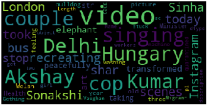
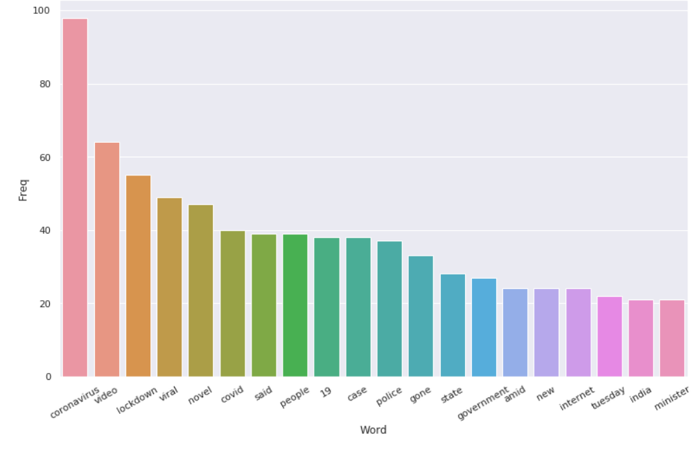
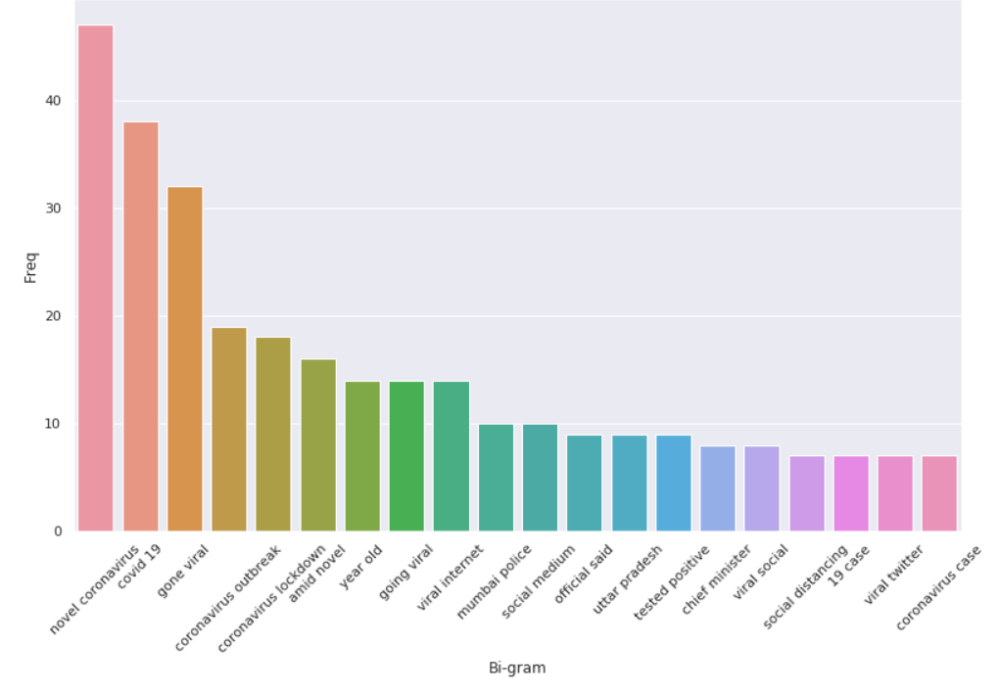
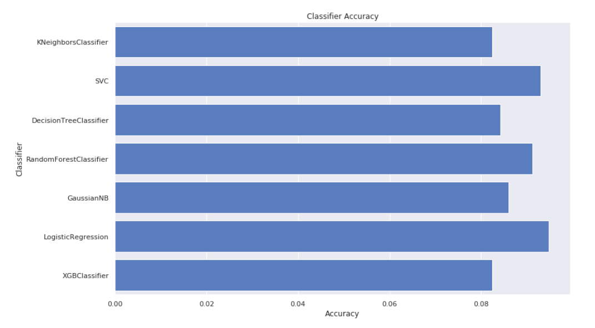

# Web-crawling-and-news-virality-prediction
Project for crawling online news sites and anticipating the likelihood of its virality. This is an example of web scraping and crawling with BeautifulSoup4 python package. I scraped news titles and their descriptions from online news sites and predicted whether a given news article is likely to be viral or not.

## Requirements
-[BeautifulSoup](https://pypi.org/project/beautifulsoup4/) 

Beautiful Soup is a Python package for parsing HTML and XML documents. It creates a parse tree for parsed pages that can be used to extract data from HTML, which is useful for web scraping.
Use the package manager pip to install BeautifulSoup .
For Python3:
```
pip install beautifulsoup4
```

-[Requests](https://pypi.org/project/requests/)

Requests is a Python to make HTTP requests simpler and more human-friendly. 
```
pip install requests
```

-[WordCloud](https://pypi.org/project/wordcloud/)

Word Cloud is a data visualization technique used for representing text data in which the size of each word indicates its frequency or importance.
```
pip install wordcloud
```

## Getting Started
This project is divided into five steps:

### 1. News Scraping

The objective of this step is to scrap webpages and create a dataframe with title and description for each news url. I have collected both viral and non-viral news articles from the site as training set. This is done using [BeautifulSoup](https://pypi.org/project/beautifulsoup4/) and [Requests](https://pypi.org/project/requests/) libraries for Python.

### 2. Cleaning Data

This step involves making text lowercase, removing punctuations,removing stopwords,removing numerical values, tokenization and lemmatization. Python libraries [nltk](https://www.nltk.org/) and [re](https://docs.python.org/3/library/re.html) have been used here to clean the text.

### 3. Document-Term Matrix

A DTM is a matrix that describes the frequency of terms that occur in a collection of documents where every row will represent a different document and every column will represent a different word. I have created document-term matrix for train and test data. This is achieved with the help of scikit-learn's [CountVectorizer](https://scikit-learn.org/stable/modules/generated/sklearn.feature_extraction.text.CountVectorizer.html).

### 4. Data Visualization

[Word Cloud](https://pypi.org/project/wordcloud/) is used to visualize the most common words used in the news descriptions.

   
        
I have also plotted the frequencies of uni-grams and bi-grams with the help of [matplotlib](https://matplotlib.org/) and [seaborn](https://seaborn.pydata.org/) libraries for python.





### 5. Prediction

As test set I have used both trending and normal urls from India Today's website. I have added a classifier comparison to check which model gives the best possible accuracy on our training data.



I have used [confusion matrix](https://scikit-learn.org/stable/modules/generated/sklearn.metrics.confusion_matrix.html#sklearn.metrics.confusion_matrix) and [accuracy_score](https://scikit-learn.org/stable/modules/generated/sklearn.metrics.accuracy_score.html) from [sklearn.metrics](https://scikit-learn.org/stable/modules/classes.html#module-sklearn.metrics) to asess the predictions.


